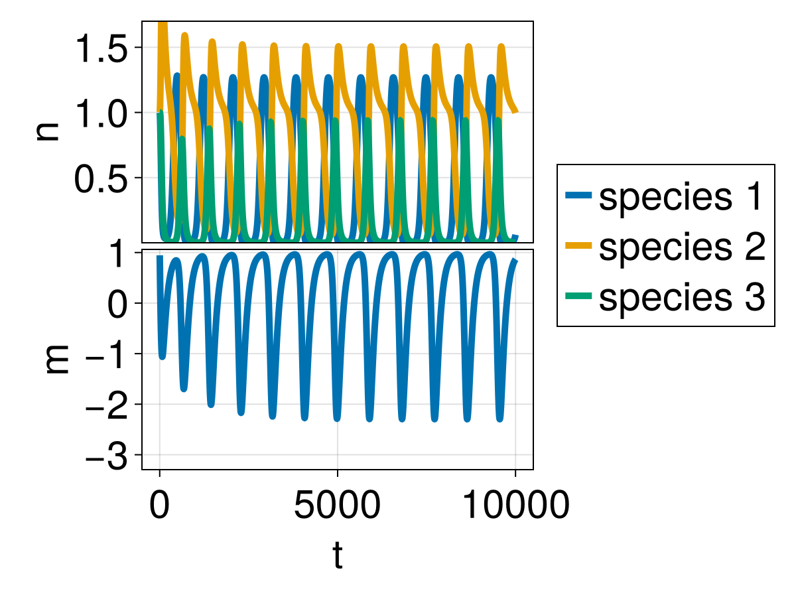

# HOIspeednetwork

## Installation
This code base is using the [Julia Language](https://julialang.org/) and
[DrWatson](https://juliadynamics.github.io/DrWatson.jl/stable/)
to make a reproducible scientific project named
> HOIspeednetwork

It is authored by Thomas Van Giel.

To (locally) reproduce this project, do the following:

0. Download this code base. Notice that raw data are typically not included in the
   git-history and may need to be downloaded independently.
1. Open a Julia console and do:
   ```
   julia> using Pkg
   julia> Pkg.add("DrWatson") # install globally, for using `quickactivate`
   julia> Pkg.activate("path/to/this/project")
   julia> Pkg.instantiate()
   ```

This will install all necessary packages for you to be able to run the scripts and
everything should work out of the box, including correctly finding local paths.

You may notice that most scripts start with the commands:
```julia
using DrWatson
@quickactivate "HOIspeednetwork"
```
which auto-activate the project and enable local path handling from DrWatson.


## How to use

The ```scripts``` folder contains all the scripts necessary to generate the plots and data that was used in the paper.

- ```system_timeseries_simulation.jl``` can be run to obtain the timeseries plot of a single ecosystem.


- ```scripts/Oscillation_region/omg_beta_oscillations.jl``` can be run to obtain figures for fixed values of $\alpha$, to obtain the regions of oscillations and coexistence, such as in Fig. 3 in the main text or Fig S1 in the supplementary material.


<p float="left">
  
   
  
</p>